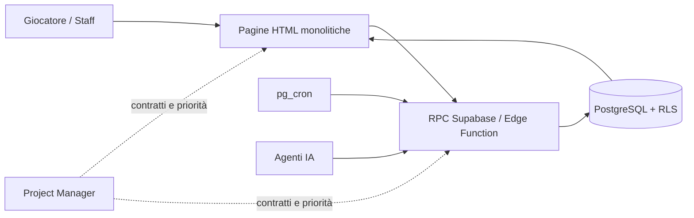
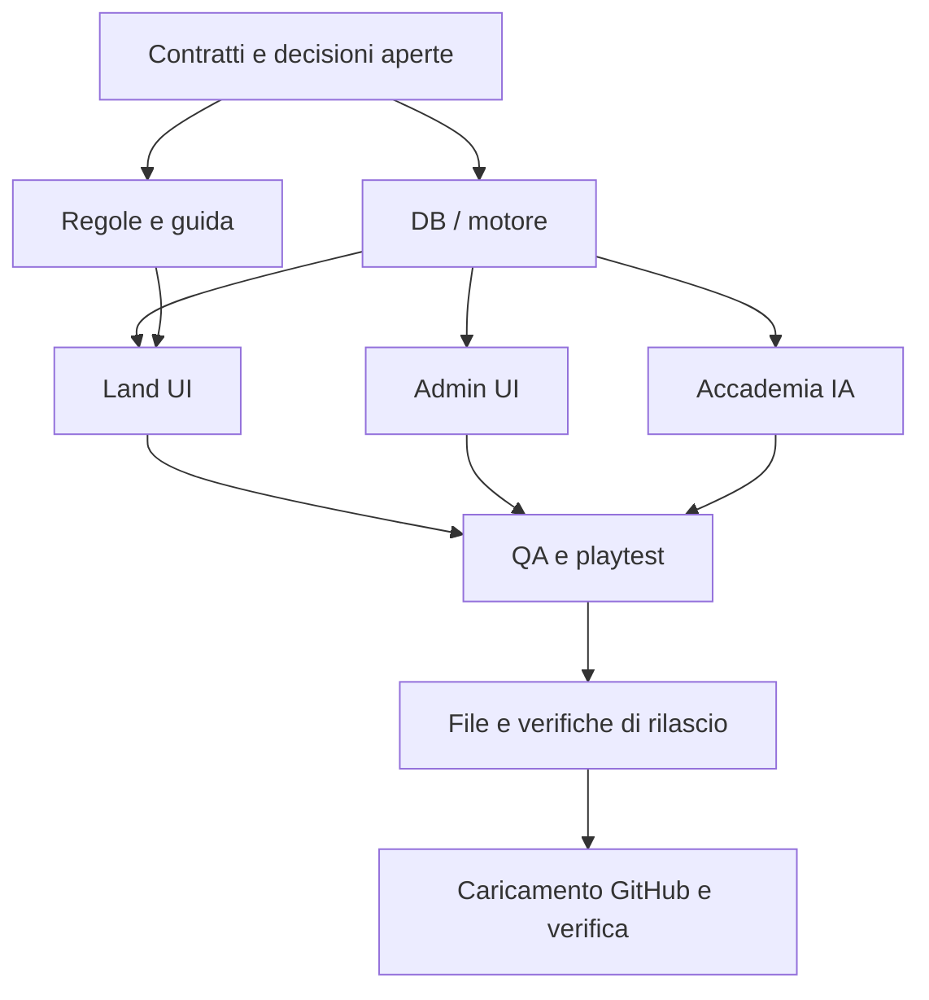

# The Untold Story — workflow multi-agent

**Origine:** fotografia organizzativa del 03/08/2026, con successive decisioni indicate nel testo. **Allineamento delle istruzioni esistenti: 09/09/2026.** Numeri, roadmap, backlog e sprint di agosto restano riferimenti storici, non incarichi da riaprire. Lo stato generale si legge in `dossier/01_STATO_ATTUALE.md`, quello operativo nelle schede d'area e nel tabellone `dossier/04_LAVORI_APERTI.md`, con date e limiti delle verifiche. Questo documento non sostituisce `AGENTS.md`, database, regolamento o fonti vive e **non attiva il nuovo processo organizzativo ancora da definire**.

## 1. Mappa del progetto

| Livello | Componenti | Fonte di verità | Rischio di collisione |
|---|---|---|---|
| Frontend | HTML statico monolitico: `land`, `admin`, `regole`, `guida` e pagine informative | sito pubblicato e GitHub, copia locale riconciliata | Alto: stile e script nello stesso file |
| Regole e contenuto | `sito_live/REGOLE.md`, `regole.html`, `STORIA.md`, dossier, specifiche | regolamento vivo + decisioni approvate | Medio |
| Backend | Supabase: PostgreSQL, RLS, RPC `SECURITY DEFINER`, Edge Function e cron; consistenza numerica nella fotografia datata di `01_STATO_ATTUALE.md` | database produzione; i documenti riportano data e limiti della verifica | Molto alto |
| Sistemi | combattimento, chat/role, Accademia IA, progressione, clan, premi, evocazioni, Cercoteri, missioni | contratti RPC + database | Alto |
| Qualità | banchi di prova, simulazioni, checklist di collaudo | prova sul gioco, non solo SQL | Basso |
| Operazioni | GitHub Pages, caricamento autonomo dei file approvati e verificati, controllo del dominio | commit e file effettivamente pubblicato, registro `PUBBLICAZIONE.md` | Medio |

**Censimento storico del 03/08/2026:** 61 tabelle RLS, 4 Edge Function, 4 cron, 16 personaggi, 355 tecniche di clan, 20 missioni, 52 emblemi, 41 record di evocazione, 9 `bijuu`, 6 `evofam` e presenza di `characters.cercoterio`. Questi numeri non descrivono il presente: per orientarsi usare `01_STATO_ATTUALE.md` e la scheda d'area; prima di dichiarare lo stato del backend verificare il database. Il dossier non prevale su una verifica viva.

## 2. Architettura e confini

Regola dominante: **l'IA racconta, il server comanda**. Client e IA non decidono mai danni, XP, requisiti, promozioni o completamenti. Le pagine sono monoliti: ogni modifica a una pagina è un'unità atomica assegnata a una sola persona alla volta.

## 3. Domini, coworker e confini

Le etichette descrivono competenze, non agenti già attivati né permessi automatici. Il mandato del PM e la tabella owner/reviewer di `AGENTS.md` determinano lo scope effettivo. Gli artefatti vanno nel cantiere assegnato (`management/candidati/<CANTIERE>/` durante la transizione) e nella sua scheda d'area; i percorsi applicativi elencati richiedono autorizzazione e riconciliazione della copia pubblicata.

| Coworker | Responsabilità | Directory/file autorizzati | Vietato | Dipende da |
|---|---|---|---|---|
| PM-ORCHESTRATORE | backlog, contratti, integrazione e conflitti | documenti di coordinamento esistenti assegnati, schede d'area e cantiere autorizzato | codice app e DB senza approvazione; nuovi cantieri senza mandato | tutti |
| DB-CORE | schema, RPC, RLS, cron, invarianti | database e migrazioni approvate | pagine HTML, regole editoriali | PM + contratto |
| COMBAT-CORE | motore, parser, round, effetti | funzioni/tabelle combattimento, `motore_combattimento_spec.md` | `land.html` salvo coordinamento | DB-CORE |
| LAND-UI | mappa, chat, combattimento e layout della land | solo `sito_live/land.html` | DB, altri HTML | contratti DB-CORE/COMBAT |
| SCHEDA-UI | scheda del personaggio: progressione, premi, clan, evocazioni, inventario e identità come li vede il giocatore | solo `sito_live/scheda.html` | DB, altri HTML, regole dei domini rappresentati | contratti DB-CORE e decisioni degli owner di dominio |
| ACADEMY-AI / NARRATIVE-AI | Accademia, narratori, Edge Function e copioni nel dominio assegnato | artefatti del cantiere, Edge Function e tabelle autorizzate | `land.html` salvo interfaccia concordata; decisioni meccaniche affidate all'IA | DB-CORE |
| ADMIN-CONTENT | pannello staff, cataloghi, emblemi, contenuti amministrativi | `sito_live/admin.html`, specifiche contenuto | funzioni core | DB-CORE |
| RULES-LORE | regolamento, guida, cronologia e testi | `sito_live/REGOLE.md`, `regole.html`, dossier, contenuti | DB e JS applicativo | decisioni PM |
| ACCOUNT-PRIVACY | accesso, privacy, email, GDPR | pagine di accesso/privacy e template autorizzati | credenziali, account Riuji, policy DB | DB-CORE |
| QA-PLAYTEST | banchi, simulazioni, collaudo giocato e regressioni | banchi/referti nel cantiere assegnato; fonti e strumenti esistenti pertinenti | mutazioni fuori scope; test live fuori dai percorsi protetti autorizzati | contratti stabilizzati; deroga ai collaudi di funzioni già pubblicate in `AGENTS.md` |
| RELEASE-STEWARD | preparazione dei file, confronto SHA/diff, caricamento GitHub e verifica del dominio | artefatti di rilascio esistenti e righe pertinenti di `PUBBLICAZIONE.md` | file estranei; apply/deploy Supabase senza autorizzazione nominativa | lavoro approvato, pronto e verificato |

### Scheda standard del coworker

- **Input:** briefing di dominio, task ID, file autorizzati, contratto e criterio di accettazione.
- **Output:** diff limitato al proprio scope, prove e limiti, `SCHEDA.md` aggiornata, `HANDOFF.md` sovrascritto nel formato di `AGENTS.md` e riga di `STORICO.md`; stato operativo riportato nella scheda d'area.
- **Checklist:** fonte viva letta, contratto verificato, nessun segreto, nessuna modifica fuori scope, prova pertinente.
- **Criterio di completamento:** requisiti e invarianti del mandato, prove pertinenti e gate previsti da `AGENTS.md`; distinguere candidato pronto, apply, deploy, enable, collaudo e apertura generale. Il caricamento GitHub non certifica il funzionamento del backend; «in uso» lo dichiara Antonello.
- **Limite operativo:** nessun coworker apre file pesanti o l'intero archivio per orientarsi; usa il suo context pack e chiede al PM ciò che manca.

## 4. Ownership

| Asset | Owner | Reviewer | Regola |
|---|---|---|---|
| `sito_live/land.html` | LAND-UI | COMBAT-CORE o QA-PLAYTEST | lock esclusivo per task |
| `sito_live/scheda.html` | SCHEDA-UI | DB-CORE (contratto e sicurezza) · QA-PLAYTEST (flusso visibile) | lock esclusivo; base riconciliata col file pubblicato prima di patchare |
| `sito_live/admin.html` | ADMIN-CONTENT | DB-CORE | lock esclusivo |
| `sito_live/regole.html` + `sito_live/REGOLE.md` | RULES-LORE | PM-ORCHESTRATORE | sempre insieme, changelog incluso |
| `sito_live/guida.html` | RULES-LORE | PM-ORCHESTRATORE | allineata al comportamento reale; contributo UI secondo scope |
| accesso, privacy e email | ACCOUNT-PRIVACY | DB-CORE | mai leggere/stampare segreti |
| RPC, RLS, trigger, cron e schema | DB-CORE | PM-ORCHESTRATORE | modifica solo con piano approvato |
| modello e funzioni combattimento | COMBAT-CORE | DB-CORE | contratto prima della UI |
| Accademia, narratori ed Edge Function | ACADEMY-AI / NARRATIVE-AI | DB-CORE | IA narrativa, server autoritativo |
| banchi e checklist | QA-PLAYTEST | owner del dominio | testano codice reale, non duplicati |
| `dossier/` e questo workflow | RULES-LORE | PM-ORCHESTRATORE | le schede di dominio sono aggiornate dall'owner incaricato; documenti centrali coordinati dal PM |

Un file, un owner alla volta. Prima della scrittura si verifica se le task condividono la cartella o usano copie isolate, poi si ricontrolla l'impronta del file letto: un cambiamento richiede riconciliazione con l'owner, senza sovrascrittura. Una modifica al contratto client/server coinvolge owner DB, PM e consumer interessati; la UI dipendente integra il contratto concordato. Per ogni candidata restano un solo passaggio indipendente, una sola correzione aggregata e una sola controverifica finale, secondo `AGENTS.md`.

**Decisione conservata, `scheda.html` (PM, 08/08).** DB-CORE e QA-PLAYTEST possono contribuire su dimensioni distinte, senza aprire due cicli di review dello stesso candidato: DB-CORE guarda contratto e sicurezza, QA-PLAYTEST il flusso visibile. SCHEDA-UI
integra la pagina monolitica **senza assorbire la titolarità delle regole dei domini che vi compaiono**:
progressione, premi, clan, evocazioni e identità restano ai rispettivi owner, e la scheda ne mostra
il risultato. Quando più monoliti sono toccati dallo stesso mandato, l'ordine è **un file per volta,
un owner per volta**.

## 5. Contratti pubblici minimi

| Contratto | Owner | Consumatori | Versionamento |
|---|---|---|---|
| Funzioni RPC e payload JSON | DB-CORE | LAND-UI, SCHEDA-UI, ADMIN-CONTENT, ACCOUNT-PRIVACY | `CONTRACT-xxx`; aggiunte compatibili, breaking change solo con migrazione coordinata |
| Dati di combattimento (azioni, fase, esito) | COMBAT-CORE | LAND-UI, QA-PLAYTEST | `COMBAT-xxx` |
| Dati Accademia e canali testo | ACADEMY-AI | LAND-UI, QA-PLAYTEST | `ACADEMY-xxx` |
| Regole pubblicate e numeri canone | RULES-LORE | tutti | changelog in `REGOLE.md` |
| Evidenze di rilascio | RELEASE-STEWARD | PM e Antonello | percorsi, byte, SHA-256, commit, verifica del dominio e limiti, nei registri esistenti |

Ogni contratto contiene: scopo, input, output, errori, autorizzazione, fonte server del valore, compatibilità, test di contratto e owner. Una domanda non risposta resta `OPEN`, non diventa assunzione. Sigle e registro descrivono la proposta originaria: si riusano i contratti effettivamente esistenti e i loro percorsi, senza creare ora un nuovo registro o assumere che tutte queste famiglie siano implementate.

## 6. DAG e parallelismo

**Al massimo tre cantieri in lavoro**, secondo `AGENTS.md`; nessun cantiere nuovo senza mandato del PM. Entro questo limite si parallelizzano solo scope indipendenti con owner definiti: per esempio lettura QA, analisi UI e lavoro backend su contratti già concordati. Due task non scrivono contemporaneamente lo stesso file, incluse cronologia e altre fonti centrali; una UI dipendente da un cambiamento RPC attende il contratto. Il diagramma illustra dipendenze, non attiva task o autorizza rilasci. **Il caricamento GitHub di SQL ed Edge deposita sorgenti: non è apply/deploy Supabase** e non apre gate di produzione.

## 7. Roadmap storica di agosto — non è il piano corrente

| Milestone | Obiettivo | Moduli | Dipendenze | Deliverable |
|---|---|---|---|---|
| M0 — Stabilizzare | eliminare rischi di beta e rendere il workflow operabile | dossier, release, land layout | nessuna | manifest, ownership, colonna destra stabile |
| M1 — Combattimento giocabile | round concluso correttamente, effetti coerenti, UI chiara | COMBAT, DB, LAND | decisioni aperte | prova fra giocatori veri |
| M2 — Progressione provata | primo allenamento, premio, evocazione, esame | DB, scheda/admin, QA | M0 | checklist di playtest completata |
| M3 — Accademia robusta | L3/L4 provate, consolidamento fonti AI | ACADEMY, LAND, DB | M0 | lezione reale e regressioni verdi |
| M4 — Rifinitura beta | guida, accessibilità, mobile, contenuti | RULES, LAND, QA | M1–M3 | rilascio di stabilizzazione |

## 8. Backlog storico di agosto — non riaprire senza mandato

| ID | Titolo | Owner | Priorità | Dipende da | Definizione di fatto |
|---|---|---|---|---|---|
| TASK-001 | Caricare e verificare `land.html` | RELEASE-STEWARD | P0 | — | byte confrontati, Ctrl+F5 e riscontro pagina |
| TASK-002 | Sistemare colonna destra | LAND-UI | P0 | lock `land.html` | layout provato nei pannelli dinamici |
| TASK-003 | Correggere deroga selettore tecniche | DB-CORE + LAND-UI | P0 | `CONTRACT-001` | luogo corrente passato e test room invariata |
| TASK-004 | Risoluzione a fine round | COMBAT-CORE | P0 | decisione su log/narratore | test di round e regressione comandi |
| TASK-005 | Fascia stato round | LAND-UI | P1 | TASK-004 contratto | fase corretta senza duplicare logica server |
| TASK-006 | Effetti tecniche — valori e modello | PM + COMBAT-CORE | P0 | decisione valori clan | contratto firmato e test per famiglia |
| TASK-007 | Tecniche nominate in azione | COMBAT-CORE + LAND-UI | P1 | TASK-006 | parser, errori leggibili, playtest |
| TASK-008 | L3 e L4 con utenti reali | QA-PLAYTEST + ACADEMY-AI | P0 | disponibilità giocatori | esiti osservati e difetti registrati |
| TASK-009 | Primo allenamento, premio ed evocazione | QA-PLAYTEST | P1 | — | percorso completo e niente incoerenze UI |
| TASK-010 | Allineare cronologia e skill | RULES-LORE + PM | P1 | eventi 03/08 confermati | decisioni versate, senza duplicati |
| TASK-011 | Sostituire banco scontro duplicato | QA-PLAYTEST | P1 | lock estrazione funzioni reali | test usa il codice vero |
| TASK-012 | Ridurre doppia fonte `academy_sensei` / `ai_agents` | DB-CORE + ACADEMY-AI | P2 | piano dati approvato | fonte unica, migrazione e regressione |

## 9. Rischi e refactoring prioritari

1. **Monoliti HTML:** collisioni e regressioni silenziose. Mitigazione: lock per file, diff minimo, owner esclusivo, sonda prima/dopo.
2. **Deriva documentale:** dossier, skill e DB possono divergere. Mitigazione: fonte di verità dichiarata, query mirate, aggiornamento a fine integrazione.
3. **Contratti impliciti client/server:** una UI può restare indietro. Mitigazione: registry dei contratti e compatibilità esplicita.
4. **Test che duplicano il codice:** falso verde. Mitigazione: QA estrae o invoca la funzione reale.
5. **Caricamento GitHub/cache:** patch non pubblicata, conflitto remoto o file vecchio. Mitigazione: manifest con byte, owner esclusivo, riconciliazione della testa remota, commit circoscritto e verifica del dominio.
6. **Sicurezza nel gameplay:** valore ricevuto dal client. Mitigazione: review DB-CORE di ogni parametro numerico e autorizzativo.

**Proposte originarie da riconciliare prima di riprendere:** registro contratti leggero, fonte Accademia, funzioni pure testabili nelle pagine monolitiche, consolidamento delle sonde e aggiornamento guida/skill. Non costituiscono un ordine di implementazione attuale: si confrontano con le schede vive, i materiali recuperati e le decisioni esplicite di Antonello. L'allineamento documentale non autorizza questi refactoring né crea nuovi strumenti organizzativi.

## 10. Ciclo operativo

1. Il PM assegna il lavoro e gli scope, rispettando il massimo di tre cantieri in lavoro; obiettivo, fonti vive, contratti, percorsi autorizzati e criteri di completamento si leggono nei documenti esistenti, senza creare un ulteriore pacchetto duplicato.
2. Ogni task segue l'avvio di `AGENTS.md`: `00_LEGGIMI`, `CONTESTO`, `01_STATO_ATTUALE`, `04_LAVORI_APERTI`, scheda d'area e blocchi pertinenti; se ha un cantiere, anche `SCHEDA.md` e `HANDOFF.md`. Analizza il proprio scope e distingue decisioni approvate da proposte aperte.
3. Prima di cambiare codice applicativo o database serve l'approvazione esplicita; per cambiamenti sostanziali prima il piano. Un contratto condiviso coinvolge DB, PM e consumer. L'owner non riavvia un mandato storico perché compare nel backlog di agosto.
4. L'owner completa un candidato coerente, consegna diff, prove e impatto contrattuale; si applicano budget fissato, unico passaggio indipendente, unica correzione aggregata e controverifica finale di `AGENTS.md`. PostgreSQL reale in Docker è l'ambiente ordinario; il branch Supabase temporaneo richiede rischio motivato e autorizzazione a creazione e costo. I limiti delle prove restano espliciti.
5. I gate di apply, deploy, enable e apertura generale restano distinti. Dopo il rilascio controllato si collauda il percorso reale nelle Test Room protette, conservando audit e verificando l'isolamento. Per il solo test di una funzione già pubblicata vale l'autorizzazione permanente Staff, senza imporre prima una nuova campagna locale. Chiudere soltanto la prova creata, salvo mandato di mantenerla aperta; nessuna cancellazione dello storico.
6. Quando il lavoro approvato è pronto e verificato, l'agente carica autonomamente su GitHub i soli file pertinenti, salvo scope `offline-only`/`no deploy` o divieto esplicito. Prima riconcilia testa remota, owner e drift ed esclude segreti; dopo registra commit e SHA in `PUBBLICAZIONE.md` e, per il sito, verifica dominio e build. `sito_live/` si pubblica nella root del repository; dossier e altre sorgenti mantengono il percorso relativo. Autenticazione assente o conflitto fermano il solo caricamento interessato. SQL ed Edge su GitHub restano sorgenti, senza apply/deploy Supabase impliciti.
7. L'owner riscrive le sezioni vive della scheda d'area e aggiorna `SCHEDA.md`, `HANDOFF.md` e `STORICO.md` del cantiere. Il PM coordina l'allineamento dei documenti centrali; i referti delle prove restano immutabili. Una consegna o un push non bastano per dichiarare il lavoro «in uso».

Il PM è l'unico canale fra coworker: nessun agente modifica o presume il lavoro di un altro senza una richiesta instradata e un contratto aggiornato.

## 11. Priorità e sprint della fotografia di agosto

Le priorità seguenti sono conservate per ricostruire il percorso. Prima di qualsiasi ripresa valgono stato e mandato correnti in `04_LAVORI_APERTI.md`, scheda d'area e cantiere; questi sprint non avviano automaticamente nuovi lavori.

**Priorità assolute:** pubblicare e verificare la `land.html` in coda; stabilizzare la colonna destra; chiudere il difetto della deroga; decidere i valori degli effetti tecnici prima della fase 2; ottenere playtest reali per L3/L4 e combattimento fra giocatori.

**Sprint 1 — stabilità beta:** TASK-001, TASK-002, TASK-003 e TASK-010. In parallelo: RELEASE-STEWARD prepara il manifest, RULES-LORE versa la cronologia, QA costruisce la matrice di regressione. LAND-UI resta l'unico writer di `land.html`.

**Sprint 2 — combattimento:** TASK-004, decisione di TASK-006, quindi TASK-005 e TASK-007. Prima il contratto server e il comportamento di round, poi l'interfaccia; QA prepara due scenari giocabili senza modificare codice.

**Sprint 3 — percorsi giocatore:** TASK-008, TASK-009 e TASK-011 in parallelo; TASK-012 soltanto dopo piano dati approvato. Ogni risultato di playtest aggiorna prima lo stato, poi il backlog.
