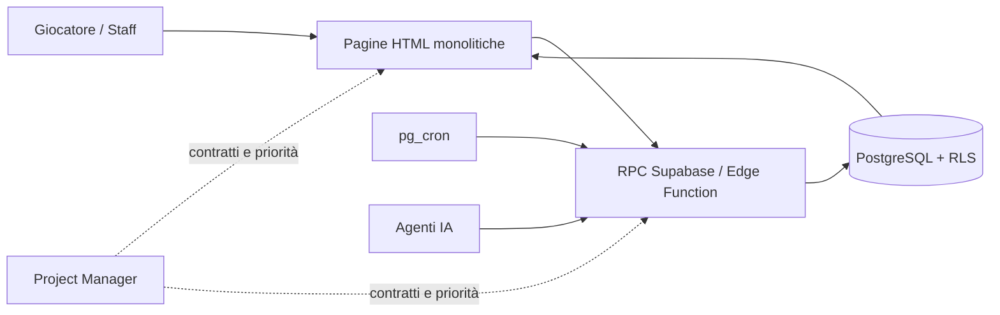
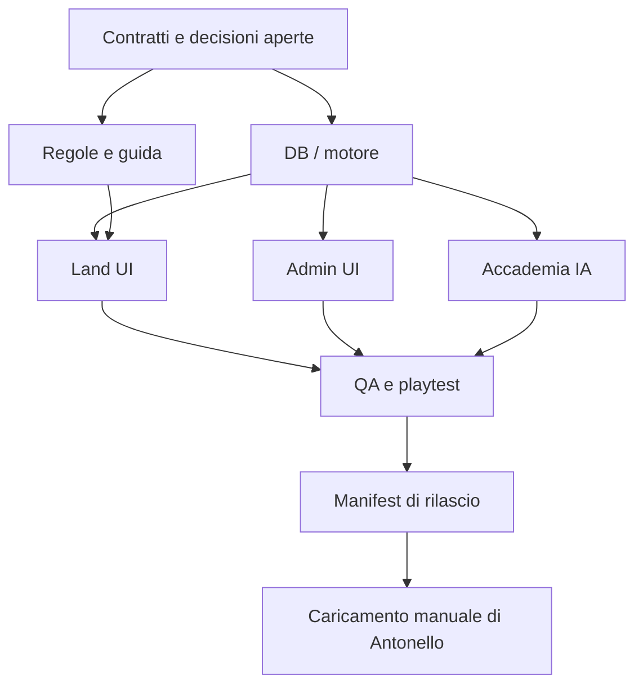

# The Untold Story — workflow multi-agent

**Fotografia:** 03/08/2026. Documento di orchestrazione: non sostituisce il database, il regolamento o i file vivi.

## 1. Mappa del progetto

| Livello | Componenti | Fonte di verità | Rischio di collisione |
|---|---|---|---|
| Frontend | HTML statico monolitico: `land`, `admin`, `regole`, `guida` e pagine informative | file vivi / sito caricato | Alto: stile e script nello stesso file |
| Regole e contenuto | `sito_live/REGOLE.md`, `regole.html`, `STORIA.md`, dossier, specifiche | regolamento vivo + decisioni approvate | Medio |
| Backend | Supabase: 61 tabelle RLS, RPC `SECURITY DEFINER`, 4 Edge Function, 4 cron | database produzione | Molto alto |
| Sistemi | combattimento, chat/role, Accademia IA, progressione, clan, premi, evocazioni, Cercoteri, missioni | contratti RPC + database | Alto |
| Qualità | banchi di prova, simulazioni, checklist di collaudo | prova sul gioco, non solo SQL | Basso |
| Operazioni | GitHub Pages, caricamento manuale e Ctrl+F5 | file effettivamente pubblicato | Medio |

**Stato verificato in produzione:** 16 personaggi, 355 tecniche di clan, 20 missioni, 52 emblemi; esistono 41 record di evocazione, 9 `bijuu`, 6 `evofam` e `characters.cercoterio`. Il dossier è utile ma non può prevalere su questi dati.

## 2. Architettura e confini

Regola dominante: **l'IA racconta, il server comanda**. Client e IA non decidono mai danni, XP, requisiti, promozioni o completamenti. Le pagine sono monoliti: ogni modifica a una pagina è un'unità atomica assegnata a una sola persona alla volta.

## 3. Domini, coworker e confini

| Coworker | Responsabilità | Directory/file autorizzati | Vietato | Dipende da |
|---|---|---|---|---|
| PM-ORCHESTRATORE | backlog, contratti, integrazione e conflitti | `dossier/`, `outputs/`, registro contratti | codice app e DB senza approvazione | tutti |
| DB-CORE | schema, RPC, RLS, cron, invarianti | database e migrazioni approvate | pagine HTML, regole editoriali | PM + contratto |
| COMBAT-CORE | motore, parser, round, effetti | funzioni/tabelle combattimento, `motore_combattimento_spec.md` | `land.html` salvo coordinamento | DB-CORE |
| LAND-UI | mappa, chat, combattimento e layout della land | solo `sito_live/land.html` | DB, altri HTML | contratti DB-CORE/COMBAT |
| SCHEDA-UI | scheda del personaggio: progressione, premi, clan, evocazioni, inventario e identità come li vede il giocatore | solo `sito_live/scheda.html` | DB, altri HTML, regole dei domini rappresentati | contratti DB-CORE e decisioni degli owner di dominio |
| ACADEMY-AI | Accademia, agenti, Edge Function, copioni | artefatti accademia, edge function e tabelle autorizzate | `land.html` salvo interfaccia concordata | DB-CORE |
| ADMIN-CONTENT | pannello staff, cataloghi, emblemi, contenuti amministrativi | `sito_live/admin.html`, specifiche contenuto | funzioni core | DB-CORE |
| RULES-LORE | regolamento, guida, cronologia e testi | `sito_live/REGOLE.md`, `regole.html`, dossier, contenuti | DB e JS applicativo | decisioni PM |
| ACCOUNT-PRIVACY | accesso, privacy, email, GDPR | pagine di accesso/privacy e template autorizzati | credenziali, account Riuji, policy DB | DB-CORE |
| QA-PLAYTEST | banchi, simulazioni, collaudo giocato e regressioni | `claude/banco_*`, `claude/sonda_*`, checklist | produzione e pagine senza passaggio PM | contratti stabilizzati |
| RELEASE-STEWARD | staging, confronto byte, pacchetto di carico e verifica cache | manifest di rilascio | codice, DB, deploy automatico | task approvati |

### Scheda standard del coworker

- **Input:** briefing di dominio, task ID, file autorizzati, contratto e criterio di accettazione.
- **Output:** diff limitato al proprio scope, test eseguiti, rischi e handoff strutturato.
- **Checklist:** fonte viva letta, contratto verificato, nessun segreto, nessuna modifica fuori scope, prova pertinente.
- **Definition of Done:** review PM; test tecnico e prova utente quando il flusso è visibile; registro decisioni aggiornato se cambia un comportamento.
- **Limite operativo:** nessun coworker apre file pesanti o l'intero archivio per orientarsi; usa il suo context pack e chiede al PM ciò che manca.

## 4. Ownership

| Asset | Owner | Reviewer | Regola |
|---|---|---|---|
| `sito_live/land.html` | LAND-UI | COMBAT-CORE o QA-PLAYTEST | lock esclusivo per task |
| `sito_live/scheda.html` | SCHEDA-UI | DB-CORE (contratto e sicurezza) · QA-PLAYTEST (flusso visibile) | lock esclusivo; base riconciliata col file pubblicato prima di patchare |
| `sito_live/admin.html` | ADMIN-CONTENT | DB-CORE | lock esclusivo |
| `sito_live/regole.html` + `sito_live/REGOLE.md` | RULES-LORE | PM-ORCHESTRATORE | sempre insieme, changelog incluso |
| `sito_live/guida.html` | RULES-LORE | LAND-UI | allineata al comportamento reale |
| accesso, privacy e email | ACCOUNT-PRIVACY | DB-CORE | mai leggere/stampare segreti |
| RPC, RLS, trigger, cron e schema | DB-CORE | PM-ORCHESTRATORE | modifica solo con piano approvato |
| modello e funzioni combattimento | COMBAT-CORE | DB-CORE | contratto prima della UI |
| Accademia/Edge Function/copiatura | ACADEMY-AI | DB-CORE | IA narrativa, server autoritativo |
| banchi e checklist | QA-PLAYTEST | owner del dominio | testano codice reale, non duplicati |
| `dossier/` e questo workflow | PM-ORCHESTRATORE | RULES-LORE | aggiornamento finale, non per ogni micro-patch |

Un owner, un reviewer al massimo. Se serve cambiare sia contratto sia UI: DB-CORE apre il contratto, PM lo congela, LAND-UI integra dopo.

**Eccezione dichiarata, `scheda.html` (PM, 08/08).** I revisori sono due, ma su dimensioni distinte e mai
sullo stesso oggetto: DB-CORE guarda contratto e sicurezza, QA-PLAYTEST il flusso visibile. SCHEDA-UI
integra la pagina monolitica **senza assorbire la titolarità delle regole dei domini che vi compaiono**:
progressione, premi, clan, evocazioni e identità restano ai rispettivi owner, e la scheda ne mostra
il risultato. Quando più monoliti sono toccati dallo stesso mandato, l'ordine è **un file per volta,
un owner per volta**.

## 5. Contratti pubblici minimi

| Contratto | Owner | Consumatori | Versionamento |
|---|---|---|---|
| Funzioni RPC e payload JSON | DB-CORE | LAND-UI, SCHEDA-UI, ADMIN-CONTENT, ACCOUNT-PRIVACY | `CONTRACT-xxx`; aggiunte compatibili, breaking change solo con migrazione coordinata |
| Dati di combattimento (azioni, fase, esito) | COMBAT-CORE | LAND-UI, QA-PLAYTEST | `COMBAT-xxx` |
| Dati Accademia e canali testo | ACADEMY-AI | LAND-UI, QA-PLAYTEST | `ACADEMY-xxx` |
| Regole pubblicate e numeri canone | RULES-LORE | tutti | changelog in `REGOLE.md` |
| Manifest di rilascio | RELEASE-STEWARD | Antonello | dimensione, hash opzionale, data e istruzioni cache |

Ogni contratto contiene: scopo, input, output, errori, autorizzazione, fonte server del valore, compatibilità, test di contratto e owner. Una domanda non risposta resta `OPEN`, non diventa assunzione.

## 6. DAG e parallelismo

In parallelo immediato: documentazione/cronologia, audit QA, analisi layout `land.html`, consolidamento del backlog e verifica del catalogo. Non in parallelo sullo stesso file: due modifiche a `land.html`, o UI prima di un cambiamento RPC non congelato.

## 7. Roadmap

| Milestone | Obiettivo | Moduli | Dipendenze | Deliverable |
|---|---|---|---|---|
| M0 — Stabilizzare | eliminare rischi di beta e rendere il workflow operabile | dossier, release, land layout | nessuna | manifest, ownership, colonna destra stabile |
| M1 — Combattimento giocabile | round concluso correttamente, effetti coerenti, UI chiara | COMBAT, DB, LAND | decisioni aperte | prova fra giocatori veri |
| M2 — Progressione provata | primo allenamento, premio, evocazione, esame | DB, scheda/admin, QA | M0 | checklist di playtest completata |
| M3 — Accademia robusta | L3/L4 provate, consolidamento fonti AI | ACADEMY, LAND, DB | M0 | lezione reale e regressioni verdi |
| M4 — Rifinitura beta | guida, accessibilità, mobile, contenuti | RULES, LAND, QA | M1–M3 | rilascio di stabilizzazione |

## 8. Backlog ordinato

| ID | Titolo | Owner | Priorità | Dipende da | Definizione di fatto |
|---|---|---|---|---|---|
| TASK-001 | Caricare e verificare `land.html` | RELEASE-STEWARD | P0 | — | byte confrontati, Ctrl+F5 e riscontro pagina |
| TASK-002 | Sistemare colonna destra | LAND-UI | P0 | lock `land.html` | layout provato nei pannelli dinamici |
| TASK-003 | Correggere deroga selettore tecniche | DB-CORE + LAND-UI | P0 | `CONTRACT-001` | luogo corrente passato e test room invariata |
| TASK-004 | Risoluzione a fine round | COMBAT-CORE | P0 | decisione su log/narratore | test di round e regressione comandi |
| TASK-005 | Fascia stato round | LAND-UI | P1 | TASK-004 contratto | fase corretta senza duplicare logica server |
| TASK-006 | Effetti tecniche — valori e modello | PM + COMBAT-CORE | P0 | decisione valori clan | contratto firmato e test per famiglia |
| TASK-007 | Tecniche nominate in azione | COMBAT-CORE + LAND-UI | P1 | TASK-006 | parser, errori leggibili, playtest |
| TASK-008 | L3 e L4 con utenti reali | QA-PLAYTEST + ACADEMY-AI | P0 | disponibilità giocatori | esiti osservati e difetti registrati |
| TASK-009 | Primo allenamento, premio ed evocazione | QA-PLAYTEST | P1 | — | percorso completo e niente incoerenze UI |
| TASK-010 | Allineare cronologia e skill | RULES-LORE + PM | P1 | eventi 03/08 confermati | decisioni versate, senza duplicati |
| TASK-011 | Sostituire banco scontro duplicato | QA-PLAYTEST | P1 | lock estrazione funzioni reali | test usa il codice vero |
| TASK-012 | Ridurre doppia fonte `academy_sensei` / `ai_agents` | DB-CORE + ACADEMY-AI | P2 | piano dati approvato | fonte unica, migrazione e regressione |

## 9. Rischi e refactoring prioritari

1. **Monoliti HTML:** collisioni e regressioni silenziose. Mitigazione: lock per file, diff minimo, owner esclusivo, sonda prima/dopo.
2. **Deriva documentale:** dossier, skill e DB possono divergere. Mitigazione: fonte di verità dichiarata, query mirate, aggiornamento a fine integrazione.
3. **Contratti impliciti client/server:** una UI può restare indietro. Mitigazione: registry dei contratti e compatibilità esplicita.
4. **Test che duplicano il codice:** falso verde. Mitigazione: QA estrae o invoca la funzione reale.
5. **Caricamento GitHub/cache:** patch non pubblicata, conflitto remoto o file vecchio. Mitigazione: manifest con byte, owner esclusivo, riconciliazione della testa remota, commit circoscritto e verifica del dominio.
6. **Sicurezza nel gameplay:** valore ricevuto dal client. Mitigazione: review DB-CORE di ogni parametro numerico e autorizzativo.

Refactoring consigliato, in questo ordine: creare un registro contratti leggero; eliminare la doppia fonte Accademia; separare progressivamente funzioni pure testabili dalle pagine monolitiche senza introdurre una riscrittura generale; consolidare le sonde; aggiornare guida/skill dopo stabilizzazione.

## 10. Ciclo operativo

1. PM seleziona un solo task e forma il context pack: obiettivo, fonti vive, contratto, file autorizzati e DoD.
2. Coworker analizza soltanto il suo scope, formula decisioni aperte e propone un diff.
3. Se cambia DB, regole o contratto: PM ottiene approvazione prima dell'esecuzione.
4. Owner consegna diff + prove + impatto contrattuale; reviewer controlla il proprio confine.
5. QA prova il flusso reale; RELEASE-STEWARD prepara il manifest.
6. L'agente carica autonomamente i soli file verificati, salvo scope `offline-only`/`no deploy`; registra commit e SHA. Solo dopo la verifica sul dominio il task diventa rilasciato. Se manca autenticazione o c'è drift, si ferma il solo caricamento e si consegna la lista esatta.

Il PM è l'unico canale fra coworker: nessun agente modifica o presume il lavoro di un altro senza una richiesta instradata e un contratto aggiornato.

## 11. Priorità assolute e prossimi sprint

**Priorità assolute:** pubblicare e verificare la `land.html` in coda; stabilizzare la colonna destra; chiudere il difetto della deroga; decidere i valori degli effetti tecnici prima della fase 2; ottenere playtest reali per L3/L4 e combattimento fra giocatori.

**Sprint 1 — stabilità beta:** TASK-001, TASK-002, TASK-003 e TASK-010. In parallelo: RELEASE-STEWARD prepara il manifest, RULES-LORE versa la cronologia, QA costruisce la matrice di regressione. LAND-UI resta l'unico writer di `land.html`.

**Sprint 2 — combattimento:** TASK-004, decisione di TASK-006, quindi TASK-005 e TASK-007. Prima il contratto server e il comportamento di round, poi l'interfaccia; QA prepara due scenari giocabili senza modificare codice.

**Sprint 3 — percorsi giocatore:** TASK-008, TASK-009 e TASK-011 in parallelo; TASK-012 soltanto dopo piano dati approvato. Ogni risultato di playtest aggiorna prima lo stato, poi il backlog.
